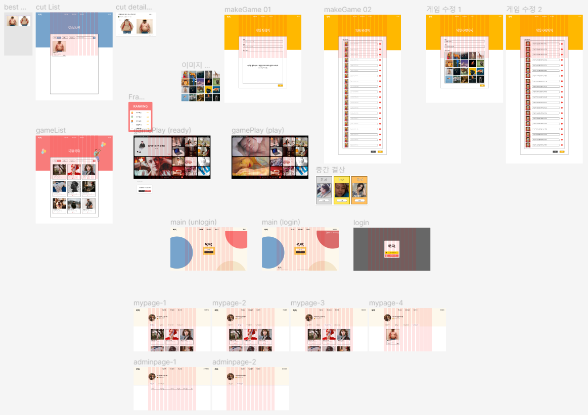

# **똑딱**

## 똑딱 의미

'똑' 닮았다.  '딱' 알겠다.

## 개요

친구들끼리 사람 혹은 사물을 보며 서로 자기가 더 닮았다고 설전을 펼치신 적 있으신가요? 
더 이상 그럴 필요 없습니다. '똑딱'이 4가지 이미지 분석 알고리즘을 이용해 누가 더 닮았는지 알려드리겠습니다.

## 목차

1. [주요 기능](#주요-기능)
2. [개발 환경](#개발-환경)
3.

## 주요 기능

---

- webRTC를 이용한 실시간 화상 게임
- 사용자가 직접 커스터마이징 가능한 문제
- 게임 과정에서 찍힌 사진을 확인, 공유 가능
- 게임 기록 보관, 확인

## 개발 환경

---

| Category        | Tech stack         | Version                    | Docker                |     |
| --------------- | ------------------ | -------------------------- | --------------------- | --- |
| Version Control | GitLab             |                            |                       |     |
|                 | Jira               |                            |                       |     |
| Documentation   | notion             |                            |                       |     |
| Front-End       | HTML5              |                            |                       |     |
|                 | CSS3               |                            |                       |     |
|                 | JavaScript(ES6)    |                            |                       |     |
|                 | vue/cli            | 5.0.8                      |                       |     |
|                 | Vue.js (Vue3)      | 3.2.45                     |                       |     |
|                 | node.js            | 14.19.0                    |                       |     |
|                 | Visual Studio Code | 1.74.2                     |                       |     |
| Back-End        | Java               | OpenJDK Azul zulu 11.60.19 | official docker image |     |
|                 | gradle             | 7.6                        | official docker image |     |
|                 | SpringBoot         | 2.7.7                      |                       |     |
|                 | Intellij           | 2022.3                     |                       |     |
| DB              | MySQL              | 8.0.31                     | official docker image |     |
| Server          | AWS EC2            |                            |                       |     |
|                 | AWS S3             |                            |                       |     |
|                 | Nginx              |                            | official docker image |     |
|                 | Ubuntu             | 22.04.1 LTS                | official docker image |     |
|                 | Openvidu           | 2.25.0                     | official docker image |     |
| CI/CD           | Docker             |                            |                       |     |
|                 | Jenkins            |                            |                       |     |
|                 | Ansible            |                            |                       |     |

---

## 서비스 아키텍쳐

---

## Jenkins를 이용한 CD 구축

---

Jenkins를 이용하여 빌드하고 전달, ansible playbook, dockerCompose를 이용하여 docker container로 배포하였습니다.  
letsencrypt를 이용하여 ssl 인증서를 적용하였고, 프론트엔드는 443(https)로 프록시로 분기, 백엔드는 /api 경로로 프록시를 걸어줬습니다.

## 이미지 분석 알고리즘

---

설명 추가 필요

## 협업툴

---

- Git
- Jira
- Notion
- Mattermost
- Webex
- Figma

## 기능 명세서

---

## API 명세서

---

## 화면 설계서

---

### 전체

### 목록 목업

### 요소 목업

## ER Diagram

---

## 컨벤션 전략

### [상세 보기](./ReadMe_contents/convention.md)

### **Git Commit Message Convention**

---

> [지라 티켓 번호] [타입]: [제목] (Ticket-Number Type: Subject)
>
> (공백)
>
> 본문 (Body)
>
> (공백)
>
> \*(optional) 꼬리말 (Footer)

### **Git Branch Convention**

---

**1. master branch**

제품으로 출시(release)될 수 있는 브랜치

**2. develop branch**

다음 출시 버전을 개발하는 브랜치

**3. feature branch**

기능을 개발하는 브랜치

### **Jira Convention**

---

**Epic > Story > Task > Sub-Task**

**Epic : 기능단위 분류**

**Story : 세부 기능**

## **[Notion](https://jet-play-ae5.notion.site/0de091d9369048ea806dd8140734cfae)**

---

- ※ 표시 : 전체 공지 사항
- 북마크 : 개발하며 필요한 자료 정리
- 미팅 : 회의 기록
- 폐기 : 사용하지 않는 자료 또는 기록 보관
- 학습 내용 공유 : 서로 알아두면 좋은 내용 공유

## EC2 포트 정리

---

|   **PORT**    |                           **이름**                           |
| :-----------: | :----------------------------------------------------------: |
|      22       |                             ssh                              |
|      80       |                      from HTTP to HTTPS                      |
|      443      |                            HTTPS                             |
|     3478      |       used by STUN/TURN server to resolve clients IPs.       |
|     8443      |                           Openvidu                           |
|     3306      |                            MySQL                             |
|     7080      |                 vue, NginX Docker Container                  |
|     8080      |                           Jenkins                            |
|     8081      |                 Spring boot Docker Container                 |
|     10022     |                       ansible ssh port                       |
|     20022     |                        dood ssh port                         |
|     30022     |                  vue, NginX Docker ssh port                  |
| 40000 - 57000 | used by Kurento Media Server to establish media connections. |
| 57001 - 65535 | used by TURN server to establish relayed media connections.  |
