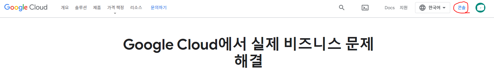
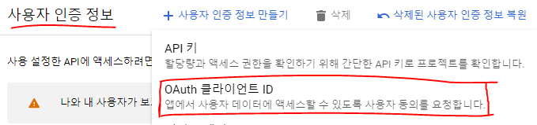
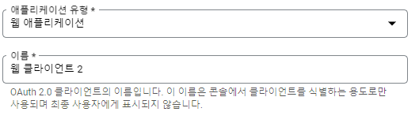
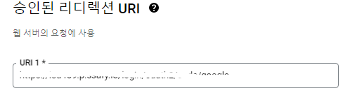
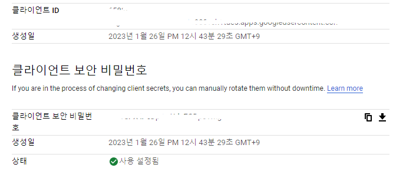
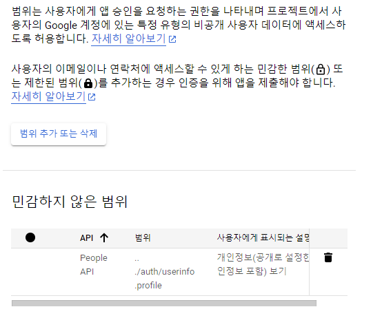

# Google Login 설정

Google cloud platform 접속 후 콘솔 화면으로 이동

API 및 인증 서비스로 이동 후 사용자 인증 정보에서 OAuth 클라이언트 ID로 인증 정보 만들기

웹 애플리케이션 유형과 이름 추가

서버에서 사용할 Redirection URI 추가

kakao API를 사용하기 위한 클라이언트 ID와 보안을 위한 Client 비밀번호 생성

profile 설정을 위한 필수 동의 설정

