# aws s3 설정

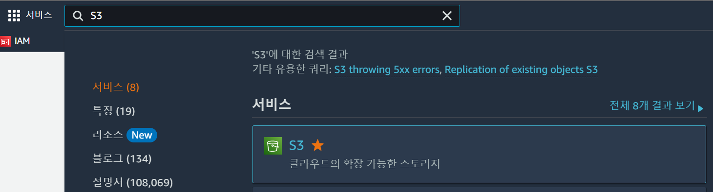

버킷 만들기 클릭

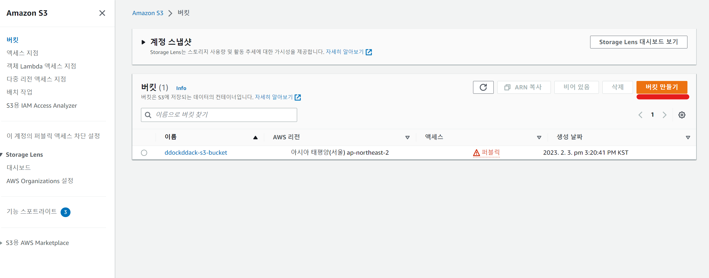

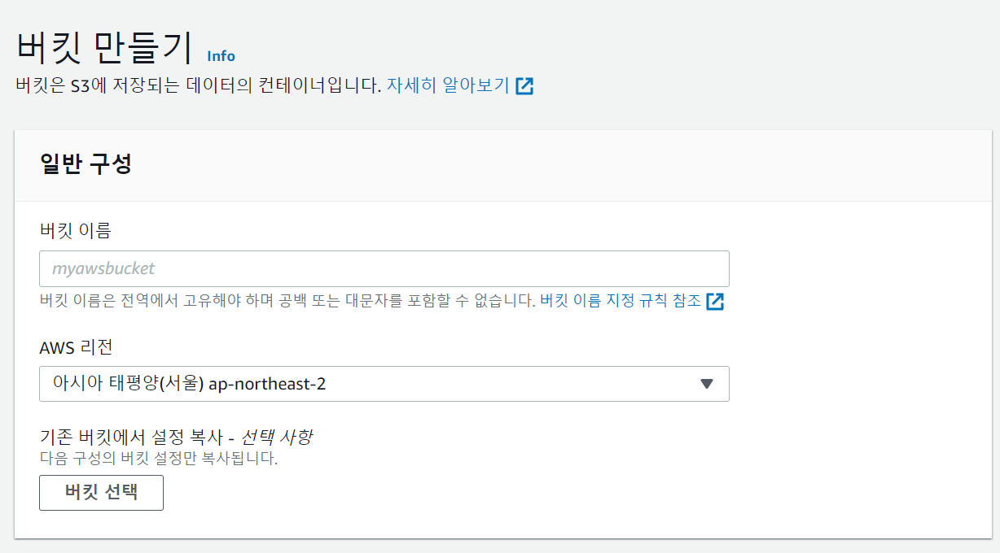

- 버킷 이름은 고유하게 설정
- AWS 리전은 아시아 태평양 ap-northeast-2 선택

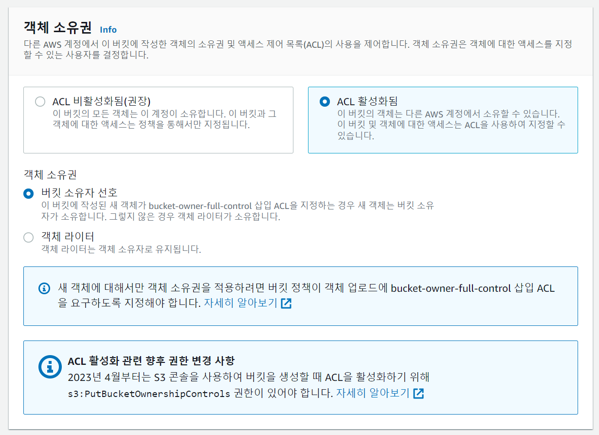

- ACL 활성화 선택

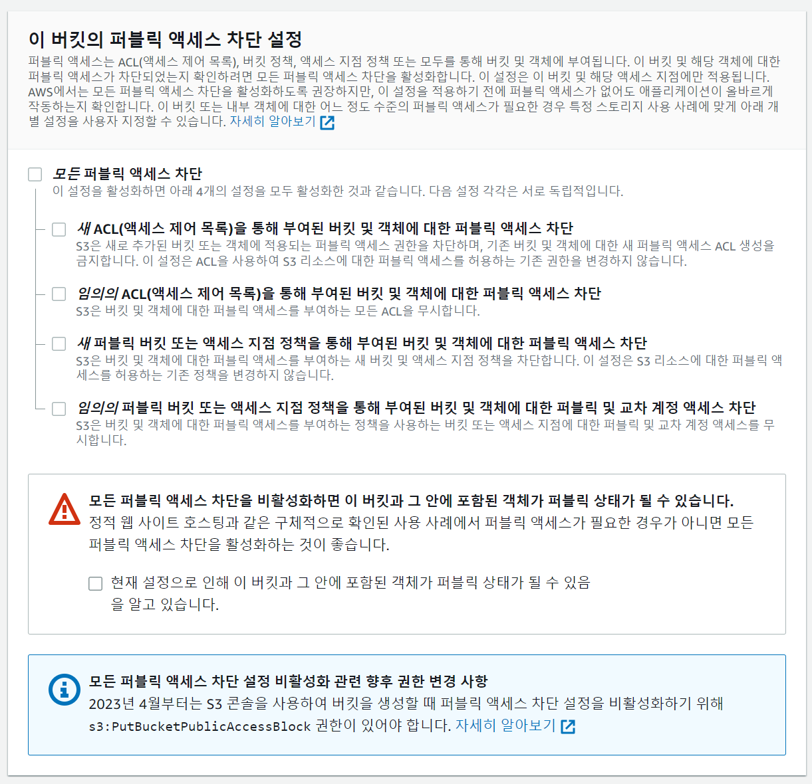

- 모든 퍼블릭 액세스 차단 해제
  - 새 ACL(액세스 제어 목록)을 통해 부여된 버킷 및 객체에 대한 퍼블릭 액세스 차단을 해제해서 객체를 업로드 할 수 있게 함
  - 임의의 ACL(액세스 제어 목록)을 통해 부여된 버킷 및 객체에 대한 퍼블릭 액세스 차단을 해제해서 업로드한 객체를 볼수 있게 함

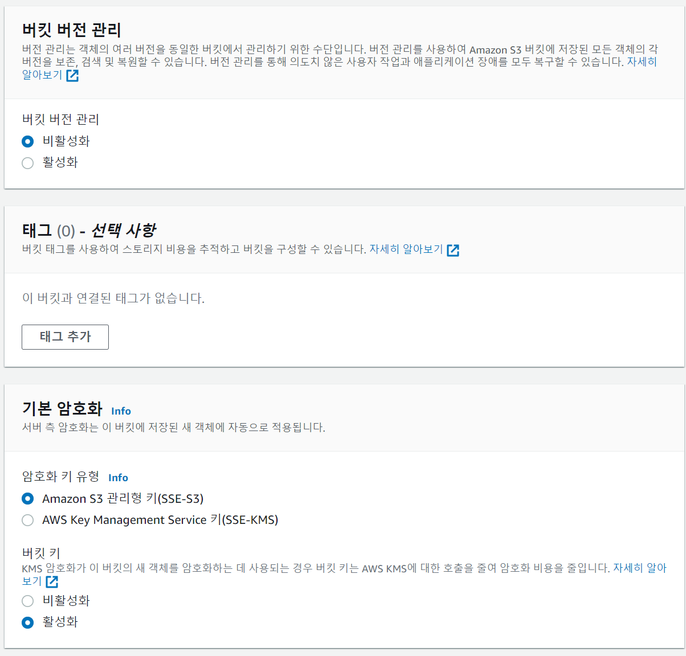

버킷 생성 설정이 끝나면 하단에 버킷만들기 클릭

보안 자격 증명(IAM) 설정(Access Key, Secret Key 발급**)**

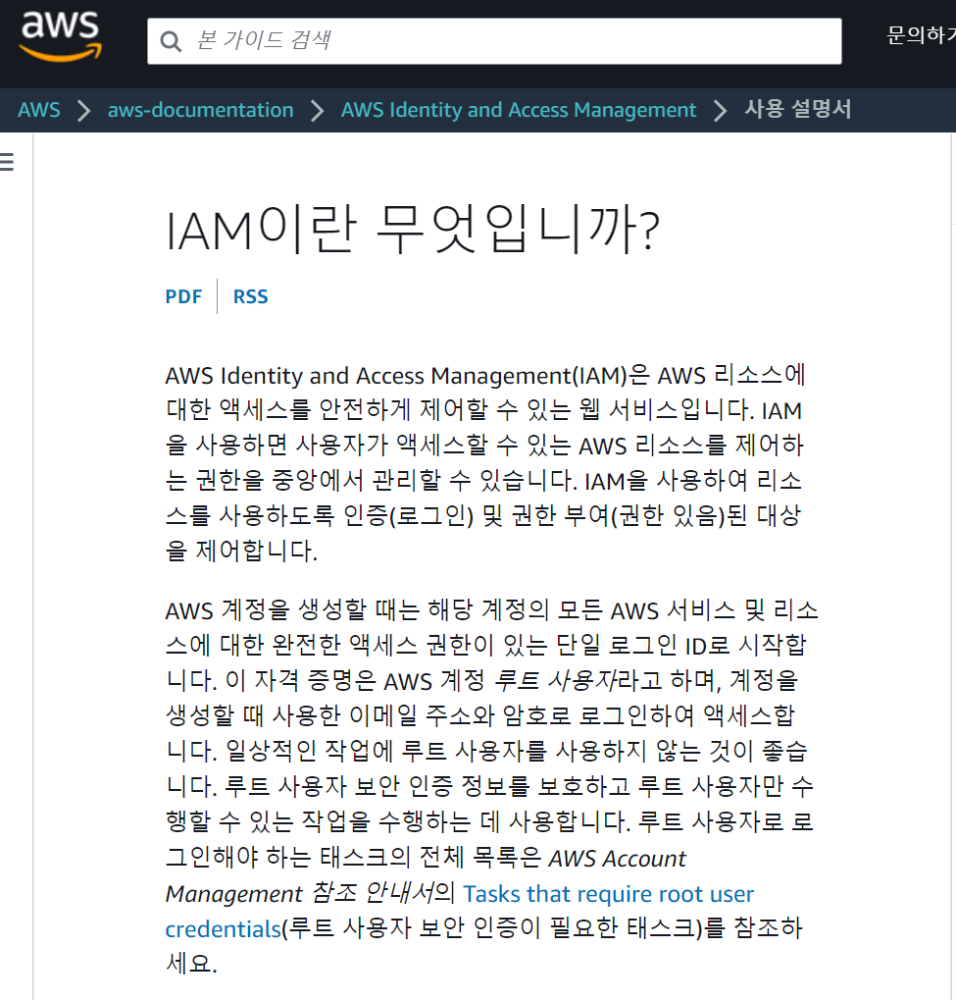

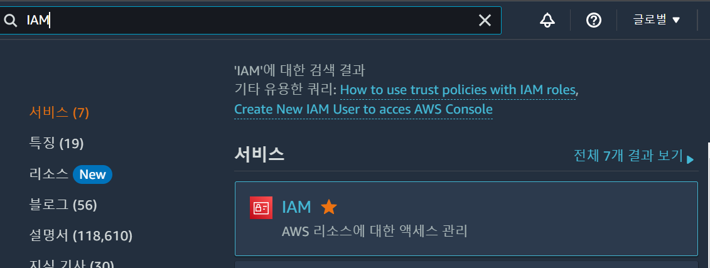

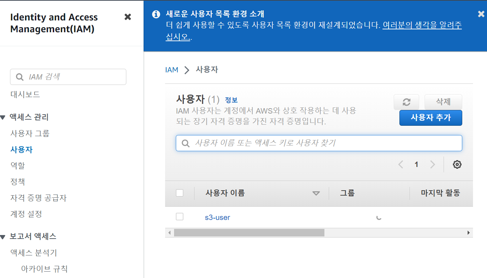

- 왼쪽 액세스 관리 메뉴에서 사용자 클릭 후 사용자 추가

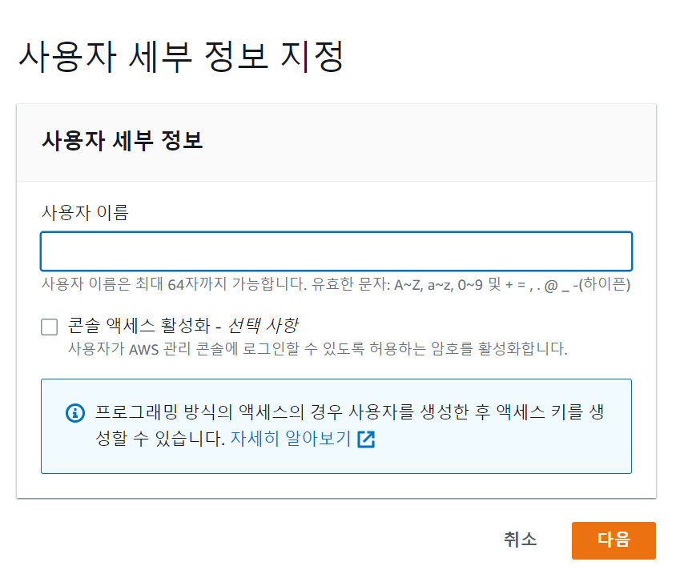

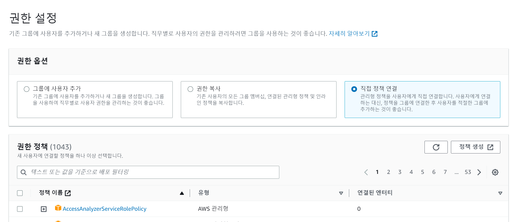

- [사용자 추가] - [기존 정책 직접 연결] - S3 검색 - 'AmazonS3FullAccess' 체크

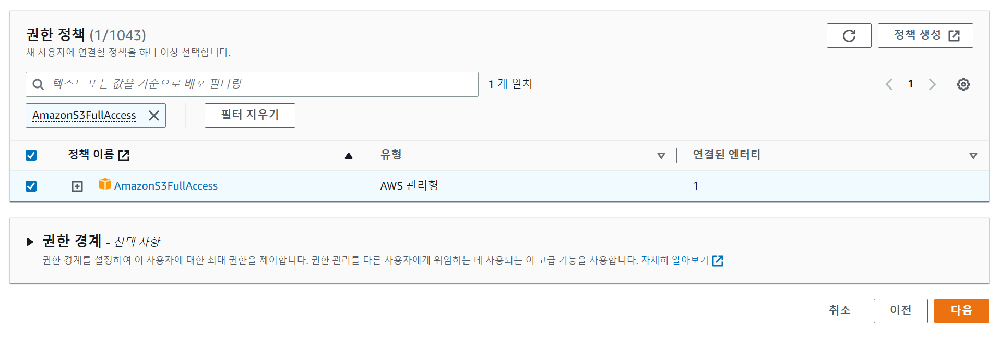

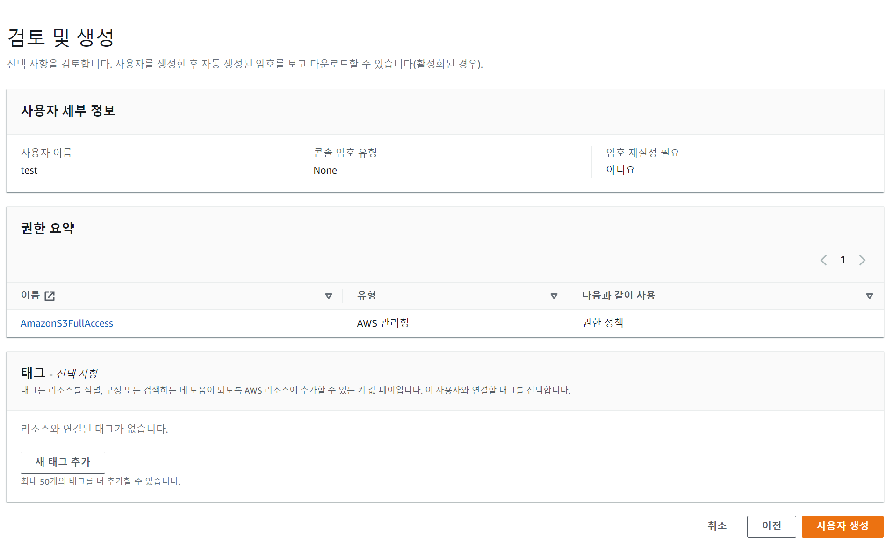

사용자 생성후 나오는 Access Key, Secret Key 확인 후 저장 (spring boot에서 사용)

Gradle에 Dependency 추가

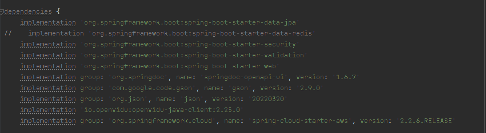

- 맨 아래 spring-ckoud-starter-aws 추가

application\*.yml (프로퍼티 설정)

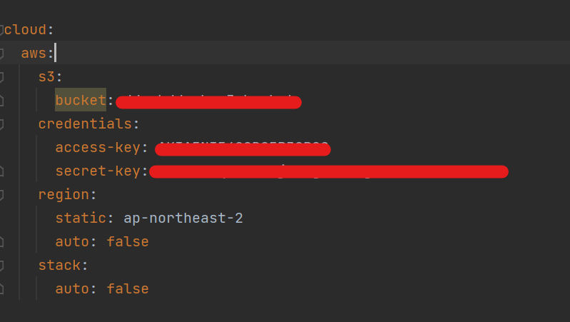

- bucket - 버킷 생성시 작성했던 버킷 명
- access-key , secret-key : IAM 설정 시 발급 받은 키 입력
